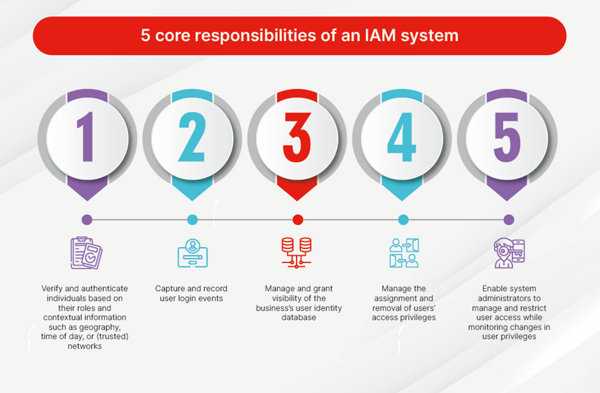
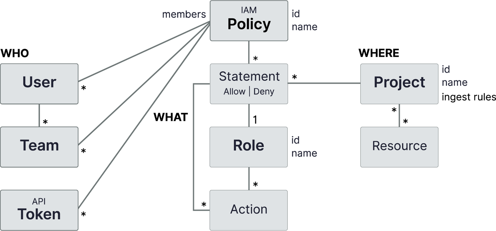

## Table of Contents

- [Identity and Access Management (IAM)](#identity-and-access-management-iam)
  

  
Show subtopics

  - [Core Components of IAM](#core-components-of-iam)
    - [Identity](#1-identity)
    - [Authentication](#2-authentication)
    - [Authorization](#3-authorization)
    - [IGA (Identity Governance & Administration)](#4-iga-identity-governance--administration)
    - [SOD (Segregation of Duties)](#5-sod-segregation-of-duties)
    - [CIAM (Customer Identity & Access Management)](#6-ciam-customer-identity--access-management)
    - [Privileged Access Management (PAM)](#7-privileged-access-management-pam)
    - [Single Sign-On (SSO)](#8-single-sign-on-sso)
    - [Accounting (Audit, Logging, and Monitoring)](#9-accounting-audit-logging-and-monitoring)

  - [Core Responsibilities of an IAM System](#core-responsibilities-of-an-iam-system)

  

- [Practice MCQs – Identity and Access Management (IAM)](#practice-mcqs--identity-and-access-management-iam)

---

- [IAM Policies](#iam-policies)
  

  
Show subtopics

  - [Core Components of an IAM Policy](#core-components-of-an-iam-policy)
  - [Types of IAM Policies](#types-of-iam-policies)
    - [Identity-Based Policies](#1-identity-based-policies)
    - [Resource-Based Policies](#2-resource-based-policies)
    - [Role-Based Access Control (RBAC) Policies](#3-role-based-access-control-rbac-policies)
    - [Attribute-Based Access Control (ABAC)](#4-attribute-based-access-control-abac)
    - [Privileged Access Policies](#5-privileged-access-policies)

  

---

- [IAM Lifecycle (Identity and Access Management)](#iam-lifecycle-identity-and-access-management)
  

  
Show subtopics

  - [Stages of the IAM Lifecycle](#stages-of-the-iam-lifecycle)
    - [Identity Creation](#1-identity-creation)
    - [Provisioning (Access Assignment)](#2-provisioning-access-assignment)
    - [Authentication (Identity Verification)](#3-authentication-identity-verification)
    - [Authorization (Access Enforcement)](#4-authorization-access-enforcement)
    - [Access Review & Monitoring (Governance Phase)](#5-access-review--monitoring-governance-phase)
    - [Privileged Access Management (PAM)](#6-privileged-access-management-pam)
    - [Identity Modification (Mover Phase)](#7-identity-modification-mover-phase)
    - [De-Provisioning (Leaver Phase)](#8-de-provisioning-leaver-phase)
    - [Audit, Compliance & Reporting](#9-audit-compliance--reporting)

  

- [Practice MCQs – IAM Policies & IAM Lifecycle](#practice-mcqs--iam-policies--iam-lifecycle)

---
---

## Identity and Access Management (IAM)

**Identity and Access Management (IAM)** is a security framework that ensures **the right person gets the right access to the right resource at the right time**.

- **Identity** → Who are you?  
  (user, employee, admin, application, service)
- **Access** → What are you allowed to do?  
  (read, write, delete, approve)

IAM is used across:
- Organizations
- Cloud platforms
- Applications
- Networks
- Databases  

to control and secure user access.

---

## Core Components of IAM

### 1. Identity
- A user, device, application, or system that requires access
- Represents *who* is requesting access

---

### 2. Authentication
- Process of **verifying the identity** of a user or system
- Confirms *who you are*

**Examples:**
- Username & password
- OTP
- Biometrics
- MFA

---

### 3. Authorization
- Determines **what resources and actions** an authenticated user is allowed
- Grants permissions based on roles or policies

**Examples:**
- Read-only access
- Admin access
- File permissions

---

### 4. IGA (Identity Governance & Administration)
- Ensures access is:
  - Appropriate
  - Approved
  - Periodically reviewed
- Helps with **compliance and audits**

---

### 5. SOD (Segregation of Duties)
- Ensures **critical or conflicting tasks** are divided among multiple users
- Prevents fraud and misuse of privileges

**Example:**  
The same user should not both approve and execute payments.

---

### 6. CIAM (Customer Identity & Access Management)
- Manages identities and access for **external users**
- Includes:
  - Customers
  - Partners
  - Vendors

---

### 7. Privileged Access Management (PAM)
- Secures and monitors **high-privilege accounts**
- Focuses on:
  - Admin users
  - Root accounts
  - Superuser access

---

### 8. Single Sign-On (SSO)
- Allows users to authenticate **once**
- Provides access to **multiple applications**
- Improves usability and security

---

### 9. Accounting (Audit, Logging, and Monitoring)
- Tracks and records user activities
- Answers *what actions were performed*

**Examples:**
- Login/logout logs
- Resource access logs
- Privilege change logs

---

## Core Responsibilities of an IAM System

1. Verify and authenticate individuals based on roles and contextual information  
   (location, time, trusted networks)

2. Capture and record user login events

3. Manage and maintain visibility of the organization’s user identity database

4. Manage assignment and removal of user access privileges

5. Enable administrators to control, restrict, and monitor user access and privilege changes

---

🔝 [TOC](#table-of-contents)

---
---

---

## Practice MCQs – Identity and Access Management (IAM)

📘 Show MCQs

### Q1. What is the primary goal of Identity and Access Management (IAM)?

- To improve network speed  
- To ensure the right person gets the right access at the right time  
- To encrypt all organizational data  
- To prevent all cyber attacks  

See answer

**Correct answer:** To ensure the right person gets the right access at the right time

---

### Q2. In IAM, what does **Identity** refer to?

- The permissions assigned to a user  
- A user or system requesting access  
- The activity logs of a user  
- A security policy  

See answer

**Correct answer:** A user or system requesting access

---

### Q3. Authentication answers which question?

- What can you do?  
- What did you do?  
- Who are you?  
- Why are you accessing the system?  

See answer

**Correct answer:** Who are you?

---

### Q4. Authorization in IAM determines:

- User identity  
- User permissions  
- User activity logs  
- User credentials  

See answer

**Correct answer:** User permissions

---

### Q5. Which IAM component ensures access is appropriate, approved, and regularly reviewed?

- PAM  
- CIAM  
- IGA  
- SSO  

See answer

**Correct answer:** IGA

---

### Q6. What is the purpose of Segregation of Duties (SoD)?

- To reduce login attempts  
- To divide critical tasks among multiple users  
- To centralize user access  
- To monitor privileged accounts  

See answer

**Correct answer:** To divide critical tasks among multiple users

---

### Q7. Which IAM component manages identities of customers and external users?

- PAM  
- IGA  
- CIAM  
- Accounting  

See answer

**Correct answer:** CIAM

---

### Q8. Privileged Access Management (PAM) mainly focuses on securing:

- Guest user accounts  
- Customer accounts  
- Administrator and root accounts  
- Temporary user accounts  

See answer

**Correct answer:** Administrator and root accounts

---

### Q9. Single Sign-On (SSO) allows users to:

- Use multiple passwords  
- Access one application only  
- Authenticate once and access multiple applications  
- Skip authentication completely  

See answer

**Correct answer:** Authenticate once and access multiple applications

---

### Q10. Accounting in IAM is responsible for:

- Granting permissions  
- Verifying identity  
- Tracking and logging user activities  
- Creating user accounts  

See answer

**Correct answer:** Tracking and logging user activities

🔝 [TOC](#table-of-contents)

---
---

## IAM Policies

An **IAM Policy** is a set of rules that defines:

- **Who** can access a resource  
- **What actions** they can perform  
- **On which resources**  

IAM policies are used to **control and enforce access permissions** securely.

---

## Core Components of an IAM Policy

1. **Subject (Who)**  
   - The user, role, group, or system requesting access

2. **Action (What)**  
   - The operation being performed  
   - Examples: read, write, delete, update

3. **Resource (On What)**  
   - The object or service being accessed  
   - Examples: file, database, server, application

4. **Effect (Allow / Deny)**  
   - Specifies whether access is permitted or blocked

5. **Condition (When / How)**  
   - Optional rules that control access based on context  
   - Examples: time, location, IP address, device type

---

---

## Types of IAM Policies

### 1. Identity-Based Policies
- Attached directly to **users, groups, or roles**
- Define what actions an identity can perform

**Example:**  
A user allowed to read and write files but not delete them.

---

### 2. Resource-Based Policies
- Attached directly to a **resource**
- Specify which identities can access the resource

**Example:**  
A storage bucket policy allowing access to a specific user.

---

### 3. Role-Based Access Control (RBAC) Policies
- Access is granted based on **roles**
- Users inherit permissions assigned to their role

**Example:**  
Admin, Manager, and Employee roles with different privileges.

---

### 4. Attribute-Based Access Control (ABAC)
- Access decisions based on **attributes**
- Attributes may include:
  - User attributes
  - Resource attributes
  - Environment conditions

**Example:**  
Allow access only if user department = HR and access time = working hours.

---

### 5. Privileged Access Policies
- Control access to **high-privilege accounts**
- Used to protect admin and root-level access

**Example:**  
Restricting admin access to specific systems and time windows.

---

## IAM Lifecycle (Identity and Access Management)

The **IAM Lifecycle** defines how a user’s **digital identity and access rights** are **created, managed, monitored, and removed** across systems during their association with an organization.

It ensures **secure, controlled, and compliant access** throughout a user’s journey.

---

## Stages of the IAM Lifecycle

### 1. Identity Creation
- Creation of a **digital identity** for a new user
- Identity may represent:
  - Employee
  - Contractor
  - Partner
  - Service or application

**Example:**  
Creating a user ID and email address for a new employee.

---

### 2. Provisioning (Access Assignment)
- Assigning access rights based on:
  - Role
  - Department
  - Job function
- Access is granted to required systems and applications

**Example:**  
Granting HR systems access to an HR employee.

---

### 3. Authentication (Identity Verification)
- Verifies the identity of the user during login
- Confirms *who the user is*

**Examples:**
- Password
- OTP
- Biometrics
- Multi-Factor Authentication (MFA)

---

### 4. Authorization (Access Enforcement)
- Determines **what actions** the authenticated user can perform
- Enforces permissions and access policies

**Example:**  
Allowing a user to read files but not delete them.

---

### 5. Access Review & Monitoring (Governance Phase)
- Regular review of user access rights
- Monitoring user activities to detect misuse
- Ensures compliance with security policies

**Example:**  
Quarterly review of employee access privileges.

---

### 6. Privileged Access Management (PAM)
- Manages and secures **high-privilege accounts**
- Applies stricter controls for admins and root users

**Example:**  
Monitoring and limiting admin access to critical systems.

---

### 7. Identity Modification (Mover Phase)
- Updates access when a user’s role or department changes
- Old access is removed and new access is assigned

**Example:**  
Employee promoted from Developer to Manager.

---

### 8. De-Provisioning (Leaver Phase)
- Removal of all access when a user leaves the organization
- Prevents unauthorized access after exit

**Example:**  
Disabling user accounts after employee resignation.

---

### 9. Audit, Compliance & Reporting
- Maintaining logs and reports for audits
- Demonstrates compliance with regulations and policies
- Supports forensic analysis

**Example:**  
Providing access logs during a security audit.

---

## Summary

- IAM Lifecycle manages identities **from onboarding to offboarding**
- Reduces security risks and unauthorized access
- Ensures compliance and accountability
- Supports secure and efficient access management

🔝 [TOC](#table-of-contents)

---
---

---

## Practice MCQs – IAM Policies & IAM Lifecycle

📘 Show MCQs

### Q1. What is the primary purpose of an IAM policy?

- To encrypt data  
- To define access control rules  
- To monitor network traffic  
- To detect malware  

See answer

**Correct answer:** To define access control rules

---

### Q2. Which component of an IAM policy defines **who** is requesting access?

- Action  
- Resource  
- Subject  
- Condition  

See answer

**Correct answer:** Subject

---

### Q3. In an IAM policy, the **Effect** component specifies:

- When access is allowed  
- Who can access  
- Allow or Deny decision  
- Which resource is used  

See answer

**Correct answer:** Allow or Deny decision

---

### Q4. Which IAM policy type is attached directly to users, groups, or roles?

- Resource-based policy  
- Identity-based policy  
- ABAC policy  
- Privileged access policy  

See answer

**Correct answer:** Identity-based policy

---

### Q5. Resource-based policies are attached to:

- Users  
- Roles  
- Resources  
- Groups  

See answer

**Correct answer:** Resources

---

### Q6. RBAC grants access based on:

- User attributes  
- Resource attributes  
- Roles  
- Time and location  

See answer

**Correct answer:** Roles

---

### Q7. ABAC decisions are based on:

- Roles only  
- Attributes and conditions  
- Identity names  
- Privileged accounts  

See answer

**Correct answer:** Attributes and conditions

---

### Q8. Privileged Access Policies mainly protect:

- Guest users  
- Customers  
- High-privilege accounts  
- Temporary users  

See answer

**Correct answer:** High-privilege accounts

---

### Q9. What is the first stage of the IAM Lifecycle?

- Provisioning  
- Authentication  
- Identity Creation  
- Authorization  

See answer

**Correct answer:** Identity Creation

---

### Q10. Provisioning in IAM refers to:

- Verifying identity  
- Assigning access rights  
- Monitoring user activity  
- Removing access  

See answer

**Correct answer:** Assigning access rights

---

### Q11. Authentication answers which question?

- What can you do?  
- What did you do?  
- Who are you?  
- Why are you accessing?  

See answer

**Correct answer:** Who are you?

---

### Q12. Authorization ensures:

- Identity verification  
- Access enforcement  
- Activity logging  
- Account creation  

See answer

**Correct answer:** Access enforcement

---

### Q13. Which IAM lifecycle phase involves periodic review of access rights?

- Authentication  
- Provisioning  
- Access Review & Monitoring  
- De-provisioning  

See answer

**Correct answer:** Access Review & Monitoring

---

### Q14. The **Mover Phase** in IAM lifecycle refers to:

- New employee joining  
- User leaving the organization  
- Role or department change  
- Privileged account access  

See answer

**Correct answer:** Role or department change

---

### Q15. De-provisioning ensures:

- New access is granted  
- Privileged access is monitored  
- Access is removed after exit  
- User identity is verified  

See answer

**Correct answer:** Access is removed after exit

🔝 [TOC](#table-of-contents)

---
---

